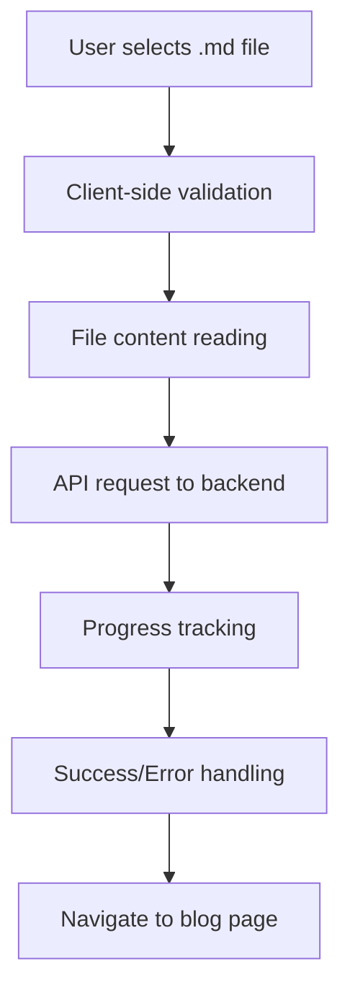

# Frontend Implementation: Upload Notes UI

> **Feature**: 5.1 Note → Blog Generation (Frontend)  
> **Status**: MVP Implementation Phase  
> **Target**: Simplified markdown file upload with real-time progress tracking

## 📋 Executive Summary

Frontend implementation for CleverDocs' note-to-blog transformation feature. This MVP focuses on seamless markdown file upload with real-time progress feedback and integration with the existing backend API.

**Key Outcomes:**
- **Simplified UX**: MD-only upload for MVP with clear future enhancement messaging
- **Real-time Feedback**: Step-by-step progress tracking during upload and processing
- **Error Resilience**: Comprehensive error handling with user-friendly messages
- **Performance Optimized**: Client-side validation and efficient API integration

---

## 🎯 MVP Requirements

### **Current Scope (MVP)**
- **File Upload**: `.md` files only (max 1MB)
- **Progress Tracking**: 5-step progress bar with individual status messages
- **Error Handling**: Inline validation with clear error messages
- **API Integration**: Real backend connection via `/api/upload/markdown`
- **Navigation**: Auto-redirect to generated blog page on success

### **Future Enhancements (Post-MVP)**
- **Multiple Input Methods**: Text input, URL import, PDF upload
- **Advanced Validation**: Content-based file validation
- **Real-time Updates**: WebSocket integration for live progress
- **Batch Processing**: Multiple file uploads
- **Preview Mode**: Content preview before upload

---

## 🏗️ Architecture Overview

### **Component Structure**
```
frontend/src/
├── pages/
│   └── UploadNotes.tsx        # Main upload page (simplified)
├── hooks/
│   └── useUpload.ts           # Upload logic and state management
├── services/
│   └── uploadService.ts       # API integration
├── types/
│   └── upload.ts              # TypeScript interfaces
└── components/
    └── UploadProgress.tsx     # Progress tracking component
```

### **Data Flow**


---

## 🔧 Technical Implementation

### **1. File Validation Strategy**

```typescript
// MVP: Extension-based validation
const validateMarkdownFile = (file: File): string | null => {
  if (!file.name.endsWith('.md')) {
    return 'Please upload a .md file';
  }
  if (file.size > 1048576) { // 1MB limit
    return 'File size must be less than 1MB';
  }
  // TODO: Add content-based validation for production
  return null;
};
```

### **2. Progress Tracking System**

```typescript
interface UploadStep {
  step: number;
  message: string;
  progress: number;
  status: 'pending' | 'active' | 'completed' | 'error';
}

const uploadSteps: UploadStep[] = [
  { step: 1, message: "Validating file...", progress: 10, status: 'pending' },
  { step: 2, message: "Uploading to server...", progress: 30, status: 'pending' },
  { step: 3, message: "Generating blog content...", progress: 70, status: 'pending' },
  { step: 4, message: "Finalizing and saving...", progress: 90, status: 'pending' },
  { step: 5, message: "Complete! Redirecting...", progress: 100, status: 'pending' }
];
```

### **3. API Integration**

```typescript
// Upload service integration
const uploadService = {
  uploadMarkdown: async (file: File): Promise<UploadResponse> => {
    const requestData = {
      filename: file.name,
      content: await file.text(),
      metadata: {
        source: 'file_upload'
      }
    };
    
    const response = await apiClient.post('/api/upload/markdown', requestData);
    return response.data;
  }
};
```

---

## 🎨 User Experience Design

### **Simplified Upload Flow**

1. **File Selection**: 
   - Large, prominent file upload area
   - Clear `.md` file requirement messaging
   - Drag-and-drop support

2. **Validation Feedback**:
   - Instant validation on file selection
   - Inline error messages below upload area
   - Success indicator for valid files

3. **Progress Tracking**:
   - 5-step progress bar with percentage
   - Individual status messages for each step
   - Loading spinners during processing

4. **Success/Error States**:
   - Clear success messaging
   - Auto-redirect to generated blog
   - Error messages with retry options

### **Coming Soon Features**

**Creative messaging for future enhancements:**
```
🚀 More ways to create blogs coming soon!
   📝 Direct text input
   🔗 URL content import  
   📄 PDF file upload
   📎 Multiple file support

Stay tuned for these exciting features!
```

---

## 🔗 API Integration Details

### **Backend Endpoint Integration**
- **Endpoint**: `POST /api/upload/markdown`
- **Request Format**: JSON with filename, content, and metadata
- **Response Format**: Status, message, and generated blog data
- **Error Handling**: HTTP status codes with detailed error messages

### **Request Structure**
```typescript
interface MarkdownUploadRequest {
  filename: string;        // "my-notes.md"
  content: string;         // File content as string
  metadata: {
    source: 'file_upload'; // Fixed for MVP
  };
}
```

### **Response Structure**
```typescript
interface UploadResponse {
  status: 'success' | 'error';
  message: string;
  data: {
    blog_id: string;
    title: string;
    processing_time_ms: number;
    expertise_levels: string[];
  };
}
```

---

## 🛡️ Error Handling Strategy

### **Client-Side Validation**
1. **File Extension**: Only `.md` files allowed
2. **File Size**: Maximum 1MB limit
3. **File Content**: Basic empty file check

### **API Error Handling**
1. **Network Errors**: Retry functionality with user feedback
2. **Validation Errors**: Display server validation messages
3. **Server Errors**: User-friendly error messages with support info
4. **Timeout Errors**: Progress indication and retry options

### **Error Display Patterns**
```typescript
// Inline error for file validation
<Text color="red.500" fontSize="sm" mt={2}>
  {fileError}
</Text>

// Alert for API errors
<Alert status="error" mt={4}>
  <AlertIcon />
  {apiError}
</Alert>
```

---

## 🚀 Performance Optimizations

### **Client-Side Optimizations**
1. **Lazy Loading**: Load upload components only when needed
2. **File Reading**: Efficient file reading with progress indication
3. **State Management**: Minimize re-renders during upload process
4. **Error Boundaries**: Graceful error handling for component failures

### **API Integration Optimizations**
1. **Request Compression**: Compress large markdown files
2. **Timeout Handling**: Appropriate timeouts for different file sizes
3. **Retry Logic**: Exponential backoff for failed requests
4. **Progress Tracking**: Efficient progress updates without polling

---

## 📊 Success Metrics

### **User Experience Metrics**
- **Upload Success Rate**: > 95% of valid files process successfully
- **Time to First Feedback**: < 500ms for file validation
- **Processing Completion**: < 60 seconds for average markdown files
- **Error Recovery**: 80% of users retry after recoverable errors

### **Technical Performance**
- **Client-side Validation**: < 100ms for file validation
- **API Response Time**: < 2 seconds for upload initiation
- **Memory Usage**: Efficient file handling without memory leaks
- **Error Handling**: 100% of errors have user-friendly messages

---

## 🔮 Future Enhancements

### **Phase 2: Multiple Input Methods**
- **Text Input**: Direct markdown text area
- **URL Import**: Web content extraction
- **PDF Upload**: PDF to markdown conversion
- **Drag and Drop**: Enhanced file drop experience

### **Phase 3: Advanced Features**
- **Real-time Collaboration**: Multi-user editing
- **Content Preview**: Live markdown preview
- **Batch Processing**: Multiple file uploads
- **Template System**: Pre-defined blog templates

### **Phase 4: AI Integration**
- **Smart Suggestions**: AI-powered content improvements
- **Auto-tagging**: Automatic tag generation
- **Content Analysis**: Readability and SEO analysis
- **Version Control**: Track content changes and improvements

---

## 🧪 Testing Strategy

### **Unit Testing**
- **File Validation**: Test all validation scenarios
- **API Integration**: Mock API responses and error states
- **Progress Tracking**: Test progress state transitions
- **Error Handling**: Test all error scenarios

### **Integration Testing**
- **Full Upload Flow**: End-to-end upload process
- **API Integration**: Real backend integration tests
- **Navigation Flow**: Blog page navigation after success
- **Error Recovery**: Test error scenarios and recovery

### **User Acceptance Testing**
- **File Upload**: Test with various markdown files
- **Error Scenarios**: Test with invalid files and network errors
- **Performance**: Test with large files and slow networks
- **Accessibility**: Test with screen readers and keyboard navigation

---

## 📚 Implementation Checklist

### **✅ Phase 1: Core Implementation**
- [ ] Create upload service and types
- [ ] Implement file validation
- [ ] Create upload hook with progress tracking
- [ ] Update UploadNotes component
- [ ] Add error handling and messaging

### **✅ Phase 2: Testing & Validation**
- [ ] Unit tests for all components
- [ ] Integration tests with backend
- [ ] Manual testing with various files
- [ ] Performance testing and optimization

### **✅ Phase 3: Polish & Documentation**
- [ ] Code review and refactoring
- [ ] Documentation updates
- [ ] Accessibility improvements
- [ ] Performance monitoring setup

---

*Last Updated: 2025-01-14*  
*Document Version: 1.0*  
*Next Review: 2025-01-21*