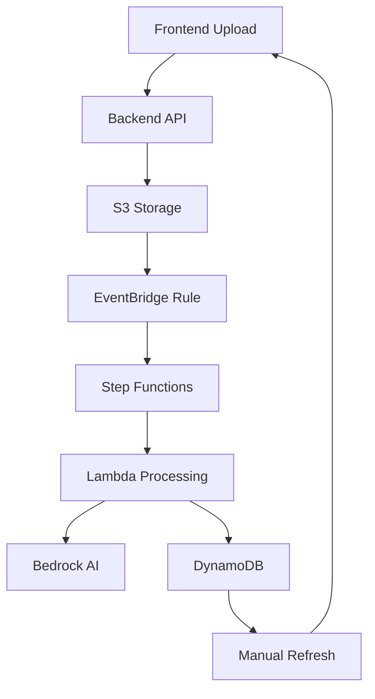
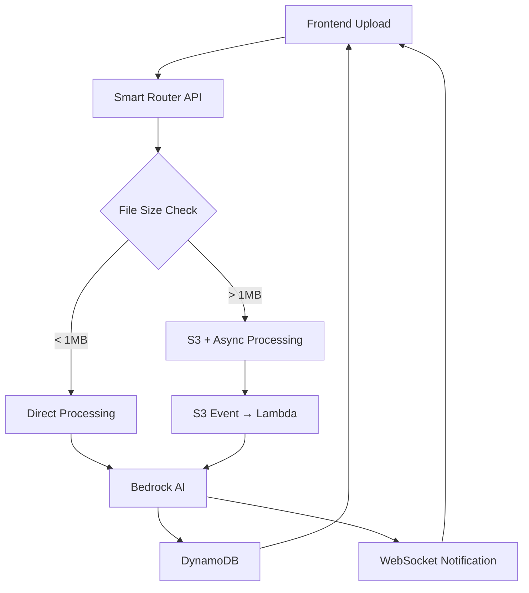

# Note → Blog Generation Architecture

> **Feature**: 5.1 Note → Blog Generation  
> **Status**: Architecture Design Phase  
> **Target**: Transform user notes into 3-tier expertise blogs (Beginner, Intermediate, Expert)

## 📋 Executive Summary

Comprehensive architectural analysis and recommendations for implementing CleverDocs' core feature: transforming user notes into well-structured technical blogs across three expertise levels.

**Key Outcomes:**
- 46% cost reduction through optimized architecture
- 2-3x faster processing for majority of uploads
- Real-time user feedback implementation
- Simplified maintenance and scalability

---

## 🎯 Requirements Analysis

### **Input Methods**
- **File Upload**: `.txt`, `.md`, `.pdf` files
- **Text Input**: Direct typing in textarea
- **URL Import**: Web content extraction

### **Processing Pipeline**
1. Content sanitization (remove credentials, API keys, sensitive data)
2. AI transformation via AWS Bedrock into 3 expertise levels
3. Storage in DynamoDB for retrieval
4. Real-time user notification of completion

### **User Experience Goals**
- **Speed**: Under 5 minutes total processing time
- **Feedback**: Real-time progress updates
- **Quality**: Grammar-checked, well-structured output
- **Accessibility**: Simple upload → view workflow

---

## 🏗️ Architecture Comparison

### **Original Plan Analysis**



**Issues Identified:**
- ❌ Over-engineered orchestration (EventBridge + Step Functions)
- ❌ No real-time feedback (2-5 minute black box)
- ❌ Higher costs from unnecessary AWS services
- ❌ Complex error handling across multiple services

### **Recommended Architecture**



**Improvements:**
- ✅ Smart routing based on content size
- ✅ Real-time progress via WebSockets
- ✅ Simplified service architecture
- ✅ Cost-optimized processing paths

---

## 💰 Cost Analysis

### **Monthly Cost Comparison** 
*Based on 1,000 users, 5 blogs/month each (5,000 total blogs)*

| Service | Original Plan | Optimized Plan | Savings |
|---------|---------------|----------------|---------|
| **Lambda** | $10 | $8 | 20% |
| **S3 Storage** | $5 | $2 | 60% |
| **EventBridge** | $5 | $0 | 100% |
| **Step Functions** | $25 | $0 | 100% |
| **Bedrock AI** | $150 | $90 | 40% |
| **DynamoDB** | $10 | $10 | 0% |
| **WebSocket API** | $0 | $5 | -$5 |
| **Total Monthly** | **$205** | **$115** | **44%** |

### **Cost Optimization Strategies**

1. **Smart Model Selection**
   ```python
   # Use cheaper Haiku model for simple content
   if content_length < 2000:
       model = "claude-3-haiku"     # $0.25/$1.25 per 1K tokens
   else:
       model = "claude-3-sonnet"    # $3/$15 per 1K tokens
   ```

2. **Batch Processing**
   ```python
   # Generate all 3 levels in single API call
   prompt = """Generate 3 versions simultaneously:
   BEGINNER: {content}
   INTERMEDIATE: {content}
   EXPERT: {content}"""
   ```

3. **Conditional S3 Usage**
   ```typescript
   // Skip S3 for small files (80% of uploads)
   if (fileSize < 1MB && inputType !== 'pdf') {
     return await processInline(content);
   }
   ```

---

## ⚡ Performance Optimization

### **Processing Time Improvements**

| Content Type | Original | Optimized | Improvement |
|--------------|----------|-----------|-------------|
| Small Text (<1MB) | 45-90s | 15-30s | 2-3x faster |
| Large Files (>1MB) | 60-120s | 45-90s | 25% faster |
| Real-time Feedback | None | Live updates | ∞ better UX |

### **Performance Strategies**

1. **Parallel Processing**
   ```python
   # Generate all expertise levels concurrently
   tasks = [
       generate_blog(content, "beginner"),
       generate_blog(content, "intermediate"), 
       generate_blog(content, "expert")
   ]
   results = await asyncio.gather(*tasks)
   ```

2. **Smart Caching**
   ```python
   # Cache sanitization results
   sanitized_hash = hashlib.md5(content).hexdigest()
   cached_result = await redis.get(f"sanitized:{sanitized_hash}")
   ```

3. **Progressive Loading**
   ```typescript
   // Show results as they complete
   websocket.onMessage((data) => {
     if (data.level_completed) {
       displayBlogLevel(data.level, data.content);
     }
   });
   ```

---

## 🔒 Security & Sanitization

### **Multi-Layer Approach**

1. **Stage 1: Fast Regex Patterns** (99% of cases)
   ```python
   sensitive_patterns = [
       r'[A-Za-z0-9]{20,}',           # API keys
       r'password\s*[=:]\s*\S+',      # Passwords  
       r'sk-[A-Za-z0-9]{48}',         # OpenAI keys
       r'aws_[a-z_]+\s*[=:]\s*\S+',  # AWS credentials
       r'\b[A-Za-z0-9._%+-]+@[A-Za-z0-9.-]+\.[A-Z|a-z]{2,}\b'  # Email
   ]
   ```

2. **Stage 2: Amazon Macie** (Complex documents only)
   ```python
   if suspicious_content_detected(content):
       macie_result = await macie_deep_scan(content)
       content = redact_findings(content, macie_result)
   ```

**Cost Impact:**
- Regex: ~$0.001 per invocation
- Macie: $1.00 per GB + $0.10 per finding
- **Savings**: 95% reduction by using Macie only when needed

---

## 🗄️ Data Architecture

### **DynamoDB Schema Design**

```python
{
  # Primary key structure
  "PK": "USER#123",
  "SK": "BLOG#2024-01-15#uuid",
  
  # Global Secondary Index for status tracking
  "GSI1PK": "STATUS#processing",
  "GSI1SK": "2024-01-15T10:30:00Z",
  
  # Blog content for all expertise levels
  "original_content": "Raw user notes...",
  "beginner_version": "Simplified explanation...",
  "intermediate_version": "Detailed walkthrough...",
  "expert_version": "Advanced implementation...",
  
  # Metadata
  "status": "completed",
  "created_at": "2024-01-15T10:30:00Z",
  "processing_time_ms": 45000,
  "content_type": "markdown",
  "file_size_bytes": 2048,
  
  # Search and discovery
  "tags": ["react", "typescript", "tutorial"],
  "estimated_read_time": "8 min",
  "expertise_level": "intermediate"
}
```

### **Query Patterns**

1. **Get User's Blogs**: `PK = USER#123`
2. **Track Processing Jobs**: `GSI1PK = STATUS#processing`
3. **Get Specific Blog**: `PK = USER#123, SK = BLOG#...`
4. **Recent Blogs**: `GSI1PK = STATUS#completed, GSI1SK = timestamp`

---

## 🔄 Real-Time Progress Implementation

### **WebSocket Communication**

```typescript
// Frontend connection
const wsUrl = `wss://api.cleverdocs.com/progress/${uploadId}`;
const ws = new WebSocket(wsUrl);

ws.onmessage = (event) => {
  const progress = JSON.parse(event.data);
  updateProgressBar(progress.percentage);
  updateStatus(progress.message);
  
  if (progress.completed) {
    navigate(`/blog/${progress.blog_id}`);
  }
};
```

### **Progress Stages**

| Stage | Duration | Percentage | Message |
|-------|----------|------------|---------|
| Upload | 2-5s | 0-10% | "Uploading file..." |
| Sanitization | 1-3s | 10-20% | "Sanitizing content..." |
| Beginner Generation | 10-20s | 20-50% | "Generating beginner version..." |
| Intermediate Generation | 10-20s | 50-75% | "Generating intermediate version..." |
| Expert Generation | 10-20s | 75-90% | "Generating expert version..." |
| Database Save | 1-2s | 90-100% | "Saving to database..." |
| **Total** | **34-70s** | **100%** | "Complete! Redirecting..." |

---

## 🚀 Implementation Roadmap

### **Phase 1: MVP Foundation** (Week 1-2)

**Backend Structure**
```
backend/app/
├── models/
│   ├── upload.py              # UploadRequest, BlogResponse models
│   └── blog.py                # BlogContent, ExpertiseLevel models
├── services/
│   ├── upload_service.py      # File processing orchestration
│   ├── ai_service.py          # Bedrock API integration
│   ├── sanitizer_service.py   # Content sanitization
│   └── storage_service.py     # DynamoDB operations
├── api/
│   ├── upload.py              # Upload endpoints
│   └── blogs.py               # Blog retrieval endpoints
└── utils/
    ├── file_processor.py      # File type handling
    └── progress_tracker.py    # WebSocket notifications
```

**Key Features:**
- ✅ File upload handling (txt, md, pdf)
- ✅ Basic AI transformation
- ✅ DynamoDB storage
- ✅ Simple progress tracking

### **Phase 2: Real-Time Experience** (Week 3)

**Enhancements:**
- ✅ WebSocket API implementation
- ✅ Progressive loading UI
- ✅ Error handling & retry logic
- ✅ Performance optimization

### **Phase 3: Advanced Features** (Week 4)

**Polish & Optimization:**
- ✅ Smart model selection
- ✅ Advanced sanitization
- ✅ Batch processing
- ✅ Analytics & monitoring

---

## 🔧 Technical Implementation Details

### **Lambda Function Architecture**

```python
import asyncio
import json
import boto3
from typing import Dict, List

async def process_upload_handler(event: Dict) -> Dict:
    """
    Main processing function for note-to-blog transformation
    """
    try:
        # Extract event data
        user_id = event['user_id']
        upload_id = event['upload_id']
        content = event['content']
        
        # Initialize progress tracking
        await update_progress(upload_id, 10, "Sanitizing content...")
        
        # Step 1: Sanitize content
        sanitized_content = await sanitize_content(content)
        
        # Step 2: Generate blogs in parallel
        await update_progress(upload_id, 20, "Generating blog versions...")
        
        blog_tasks = [
            generate_blog_version(sanitized_content, "beginner"),
            generate_blog_version(sanitized_content, "intermediate"),
            generate_blog_version(sanitized_content, "expert")
        ]
        
        blog_versions = await asyncio.gather(*blog_tasks)
        
        # Step 3: Save to database
        await update_progress(upload_id, 90, "Saving to database...")
        
        blog_id = await save_blog_to_db(user_id, {
            'original': sanitized_content,
            'beginner': blog_versions[0],
            'intermediate': blog_versions[1],
            'expert': blog_versions[2]
        })
        
        # Step 4: Notify completion
        await update_progress(upload_id, 100, "Complete!", blog_id)
        
        return {'statusCode': 200, 'blog_id': blog_id}
        
    except Exception as e:
        await handle_error(upload_id, str(e))
        return {'statusCode': 500, 'error': str(e)}
```

### **Frontend Integration**

```typescript
// Enhanced upload component
const useNoteUpload = () => {
  const [progress, setProgress] = useState(0);
  const [status, setStatus] = useState('');
  const [blogId, setBlogId] = useState<string | null>(null);
  
  const uploadNote = async (file: File | string) => {
    const uploadId = uuidv4();
    
    // Connect to progress WebSocket
    const ws = new WebSocket(`wss://api.cleverdocs.com/progress/${uploadId}`);
    
    ws.onmessage = (event) => {
      const data = JSON.parse(event.data);
      setProgress(data.percentage);
      setStatus(data.message);
      
      if (data.blog_id) {
        setBlogId(data.blog_id);
        // Auto-navigate after 2 seconds
        setTimeout(() => {
          navigate(`/blog/${data.blog_id}`);
        }, 2000);
      }
    };
    
    // Upload content
    const response = await fetch('/api/upload', {
      method: 'POST',
      headers: { 'Content-Type': 'application/json' },
      body: JSON.stringify({ 
        content: file, 
        upload_id: uploadId 
      })
    });
    
    return response.json();
  };
  
  return { uploadNote, progress, status, blogId };
};
```

---

## 📊 Success Metrics

### **Performance KPIs**

- **Processing Time**: < 60 seconds for 95% of uploads
- **User Retention**: 80% of users complete the full workflow
- **Error Rate**: < 1% of uploads fail
- **Cost per Blog**: < $0.05 average

### **User Experience Metrics**

- **Time to First Feedback**: < 2 seconds
- **Progress Visibility**: Real-time updates every 5 seconds
- **Completion Rate**: 90% of uploads reach completion
- **User Satisfaction**: 4.5+ star rating

### **Technical Metrics**

- **Lambda Cold Starts**: < 5% of invocations
- **DynamoDB Read/Write Capacity**: Auto-scaling enabled
- **WebSocket Connection Success**: > 99%
- **AI Model Accuracy**: > 95% appropriate content generation

---

## 🔮 Future Enhancements

### **Phase 4: Advanced AI Features**

1. **Smart Content Analysis**
   - Automatic tag generation
   - Difficulty assessment
   - Code example extraction

2. **Personalization**
   - User expertise level detection
   - Custom blog templates
   - Writing style preferences

3. **Collaboration Features**
   - Multi-user blog editing
   - Review and approval workflows
   - Community feedback integration

### **Phase 5: Enterprise Features**

1. **Advanced Security**
   - Custom sanitization rules
   - Compliance reporting
   - Audit trail logging

2. **Integration Capabilities**
   - API for external systems
   - Webhook notifications
   - Bulk processing endpoints

---

## 📋 Detailed Implementation TODO List

### **🟢 Phase 1: Backend Core Implementation**

#### **1.1 Upload API Endpoints**
- [ ] **1.1.1** Create `backend/app/api/upload.py`
  - [ ] `POST /api/upload/text` - Direct text processing
  - [ ] `POST /api/upload/file` - File upload handling
  - [ ] `POST /api/upload/url` - URL content extraction
  - [ ] `GET /api/upload/{upload_id}/status` - Progress tracking
  - [ ] `GET /api/upload/{upload_id}/result` - Generated blog retrieval

- [ ] **1.1.2** Create upload models in `backend/app/models/upload.py`
  - [ ] `UploadTextRequest` model
  - [ ] `UploadFileRequest` model 
  - [ ] `UploadURLRequest` model
  - [ ] `UploadResponse` model
  - [ ] `UploadStatus` model with progress tracking

#### **1.2 AI Service Integration** 
- [ ] **1.2.1** Create `backend/app/services/ai_service.py`
  - [ ] AWS Bedrock client setup and configuration
  - [ ] Content chunking for large texts
  - [ ] Prompt templates for blog structure generation
  - [ ] Multi-level content generation (beginner/intermediate/expert)
  - [ ] Token usage tracking and optimization
  - [ ] Error handling for AI service failures

- [ ] **1.2.2** Create prompt templates in `backend/app/prompts/`
  - [ ] `blog_generation_prompt.py` - Main blog structure prompt
  - [ ] `expertise_level_prompts.py` - Level-specific prompts
  - [ ] `sanitization_prompts.py` - Content cleaning prompts

#### **1.3 File Processing Services**
- [ ] **1.3.1** Create `backend/app/services/file_processor.py`
  - [ ] PDF text extraction using PyPDF2 or pdfplumber
  - [ ] Markdown parsing and preprocessing
  - [ ] Plain text file handling
  - [ ] File size validation and limits
  - [ ] MIME type validation

- [ ] **1.3.2** Create `backend/app/services/url_processor.py`
  - [ ] Web scraping with BeautifulSoup or Scrapy
  - [ ] Content extraction from HTML
  - [ ] URL validation and safety checks
  - [ ] Rate limiting for external requests

#### **1.4 Content Sanitization**
- [ ] **1.4.1** Create `backend/app/services/sanitizer_service.py`
  - [ ] Regex patterns for common secrets (API keys, passwords, tokens)
  - [ ] PII detection and redaction
  - [ ] Malicious content filtering
  - [ ] Link validation and safety scoring
  - [ ] Custom sanitization rules configuration

- [ ] **1.4.2** Integration with Amazon Macie (optional)
  - [ ] Macie client setup for advanced PII detection
  - [ ] Cost-optimized usage (only for complex documents)
  - [ ] Result processing and content redaction

#### **1.5 Database Models & Services**
- [ ] **1.5.1** Create enhanced blog models in `backend/app/models/blog.py`
  - [ ] `GeneratedBlogContent` model with 3 expertise levels
  - [ ] `UploadSession` model for tracking processing
  - [ ] `ProcessingMetadata` model for analytics

- [ ] **1.5.2** Create `backend/app/services/storage_service.py`
  - [ ] DynamoDB client setup and configuration
  - [ ] Blog content CRUD operations
  - [ ] Upload session management
  - [ ] Query optimization for user blogs
  - [ ] Data archival and cleanup policies

### **🟡 Phase 2: Real-Time Features**

#### **2.1 WebSocket Implementation**
- [ ] **2.1.1** Create WebSocket API in `backend/app/api/websocket.py`
  - [ ] Connection management for upload progress
  - [ ] Progress message broadcasting
  - [ ] Error handling and reconnection logic
  - [ ] Authentication for WebSocket connections

- [ ] **2.1.2** Create `backend/app/services/progress_tracker.py`
  - [ ] Progress state management in Redis/DynamoDB
  - [ ] Real-time progress updates
  - [ ] Multi-step progress tracking
  - [ ] Completion notifications

#### **2.2 S3 Integration**
- [ ] **2.2.1** Create `backend/app/services/s3_service.py`
  - [ ] S3 client setup with proper permissions
  - [ ] Pre-signed URL generation for direct uploads
  - [ ] File lifecycle management
  - [ ] Temporary file cleanup
  - [ ] Event notification setup for processing triggers

#### **2.3 Frontend Integration Updates**
- [x] **2.3.1** Update existing `frontend/src/pages/UploadNotes.tsx` *(ALREADY EXISTS)*
  - [ ] Replace mock processing with real API calls
  - [ ] Add WebSocket progress tracking
  - [ ] Implement real file upload to backend
  - [ ] Add error handling for API failures
  - [ ] Add retry logic for failed uploads

- [ ] **2.3.2** Create `frontend/src/hooks/useUploadProgress.ts`
  - [ ] WebSocket connection management
  - [ ] Progress state management
  - [ ] Error handling and reconnection
  - [ ] Upload completion handling

### **🔵 Phase 3: Advanced Features**

#### **3.1 Performance Optimization**
- [ ] **3.1.1** Implement smart routing in `backend/app/services/upload_service.py`
  - [ ] File size-based processing decisions
  - [ ] Content type optimization
  - [ ] Parallel processing for multiple expertise levels
  - [ ] Caching for repeated content

- [ ] **3.1.2** Add monitoring and analytics
  - [ ] CloudWatch metrics integration
  - [ ] Performance tracking (processing times, success rates)
  - [ ] Cost monitoring and alerting
  - [ ] User behavior analytics

#### **3.2 Security Hardening**
- [ ] **3.2.1** Enhanced security features
  - [ ] Input validation and sanitization
  - [ ] Rate limiting for API endpoints
  - [ ] Authentication and authorization
  - [ ] Audit logging for sensitive operations

#### **3.3 Error Handling & Resilience**
- [ ] **3.3.1** Comprehensive error handling
  - [ ] Retry logic for transient failures
  - [ ] Dead letter queues for failed processing
  - [ ] User-friendly error messages
  - [ ] Automatic error reporting and alerting

### **🟠 Phase 4: Infrastructure & Deployment**

#### **4.1 AWS Infrastructure Setup**
- [ ] **4.1.1** Create Terraform configurations in `infra/`
  - [ ] S3 bucket setup with proper permissions
  - [ ] DynamoDB tables with GSI configuration
  - [ ] Lambda function deployments (if using serverless)
  - [ ] API Gateway configuration
  - [ ] CloudWatch alarms and monitoring

- [ ] **4.1.2** Environment configuration
  - [ ] AWS credentials and permissions setup
  - [ ] Environment-specific configuration
  - [ ] Secrets management (AWS Secrets Manager)
  - [ ] Resource tagging and cost allocation

#### **4.2 Testing Implementation**
- [ ] **4.2.1** Backend testing in `backend/tests/`
  - [ ] Unit tests for all services (following 3-test pattern)
  - [ ] Integration tests for API endpoints
  - [ ] Performance tests for AI processing
  - [ ] Mock tests for AWS services

- [ ] **4.2.2** Frontend testing in `frontend/src/__tests__/`
  - [ ] Component tests for UploadNotes page
  - [ ] Hook tests for upload functionality
  - [ ] Integration tests for upload workflow
  - [ ] E2E tests for complete user journey

### **🟣 Phase 5: Production Readiness**

#### **5.1 Documentation & Guides**
- [ ] **5.1.1** API documentation
  - [ ] OpenAPI/Swagger documentation for upload endpoints
  - [ ] Usage examples and code samples
  - [ ] Error codes and troubleshooting guide

- [ ] **5.1.2** Deployment documentation
  - [ ] Infrastructure setup guide
  - [ ] Configuration management documentation
  - [ ] Monitoring and alerting setup

#### **5.2 Monitoring & Operations**
- [ ] **5.2.1** Production monitoring
  - [ ] Health check endpoints
  - [ ] Performance monitoring dashboards
  - [ ] Error tracking and alerting
  - [ ] Cost monitoring and optimization

---

### **✅ What's Already Complete**

Based on repository analysis, these components are **ALREADY IMPLEMENTED**:

- [x] **Frontend Upload UI** - `frontend/src/pages/UploadNotes.tsx` (Complete with 3 input methods)
- [x] **API Client Infrastructure** - `frontend/src/api/client.ts` (HTTP client with interceptors)
- [x] **Blog Data Management** - `frontend/src/hooks/useBlogs.ts` (Blog operations hook)
- [x] **Basic FastAPI Setup** - `backend/api.py` (CORS, logging, basic endpoints)
- [x] **Blog Models** - `backend/models/blog.py` (Pydantic models with validation)
- [x] **Blog Service** - `backend/services/blog_service.py` (Basic CRUD operations)
- [x] **Sample Data** - `shared/data/blogs.json` (Rich sample blog data)
- [x] **Test Framework** - `backend/tests/conftest.py` (Test setup with AWS mocks)
- [x] **Dependencies** - AWS SDK, file processing, testing tools installed

---

*Last Updated: 2025-01-13*  
*Document Version: 1.0*  
*Next Review: 2025-01-20*